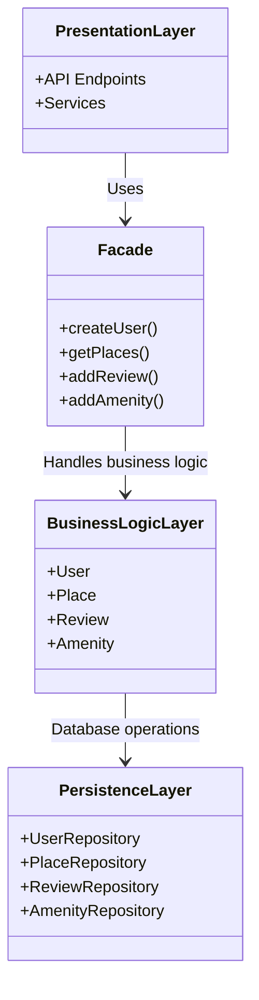
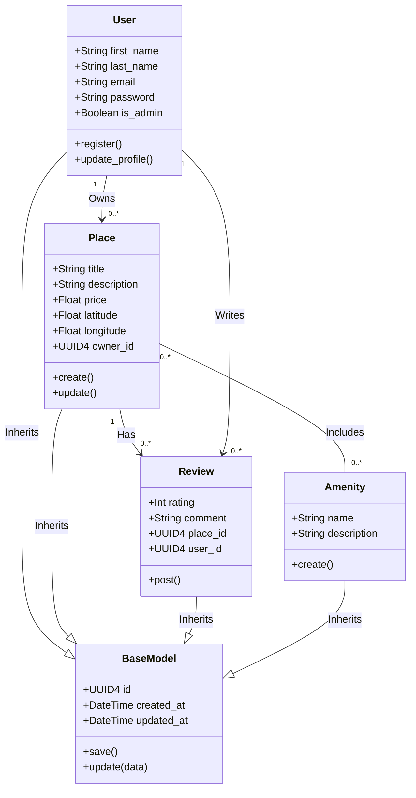
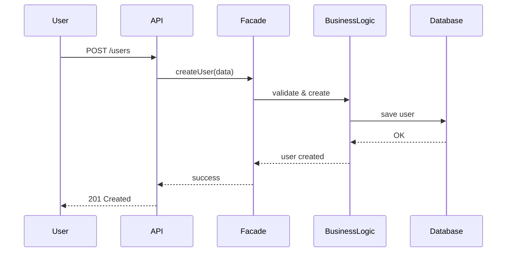

HBnB – Technical Documentation
TASK 0 - High-Level Package Diagram
Overview

This document outlines a high-level package diagram of the HBnB Evolution application. It explains the three-layer architecture and demonstrates how these layers interact through the use of the Facade design pattern.

The goal is to give a clear and structured understanding of the system’s organization, its main components, and how they collaborate.

Architecture Overview

The HBnB application follows a layered architecture composed of three primary layers:

Presentation Layer
Business Logic Layer
Persistence Layer

Each layer has a distinct role and communicates with others in a controlled and well-defined manner.

Layer Descriptions
1. Presentation Layer

This layer serves as the entry point for user interaction. It includes API endpoints and service interfaces responsible for handling incoming requests.

Whenever a user performs an action, the request is first processed here and then forwarded to the system through the Facade.

2. Business Logic Layer

This layer contains the core functionality of the application. It defines the main entities:

User
Place
Review
Amenity

Its responsibilities include:

enforcing business rules
validating data
managing the overall behavior of the application
3. Persistence Layer

This layer handles data storage and retrieval operations. It interacts directly with the database.

It includes the following repositories:

UserRepository
PlaceRepository
ReviewRepository
AmenityRepository
Facade Pattern

The Facade acts as a central interface between layers, simplifying communication and hiding internal complexity.

Advantages:
Provides a single access point to the system
Reduces system complexity
Improves maintainability and scalability


------


# TASK 1 -Business Logic Layer

   ## Overview
   
      This document describes the **Business Logic layer** of the HBnB application. It provides a detailed UML 
      class diagram representing the core entities of the system, their attributes, methods, and relationships.
      The main goal is to clearly model how the business logic of the application is structured and how the main 
      entities interact with each other.
   
---
   
   ## Business Logic Layer
   
      The Business Logic layer contains the core entities of the application:
      - User
      - Place
      - Review
      - Amenity
      These entities define the main functionality of the system and enforce business rules.
   
---

## Class Diagram



---


# TASK 2 - API Calls

   ## Overview
      This document shows 2 main API flows in the HBnB application using sequence diagrams.  
      Each diagram illustrates how the Presentation, Business Logic, and Persistence layers interact.
   
---

# User Registration


# Review Submission Flow


 # Place Creation
 ```mermaid
sequenceDiagram
participant User
participant API
participant Facade
participant BusinessLogic
participant Database

User->>API: POST /places
API->>Facade: createPlace(data)
Facade->>BusinessLogic: validate place
BusinessLogic->>Database: save place
Database-->>BusinessLogic: OK
BusinessLogic-->>Facade: place created
Facade-->>API: success
API-->>User: 201 Created
```
# Fetching a List of Places
 ```mermaid
sequenceDiagram
participant User
participant API
participant Facade
participant BusinessLogic
participant Database

User->>API: GET /places
API->>Facade: getPlaces(filters)
Facade->>BusinessLogic: fetch data
BusinessLogic->>Database: query places
Database-->>BusinessLogic: results
BusinessLogic-->>Facade: places list
Facade-->>API: response
API-->>User: 200 OK + data
```

 ---
